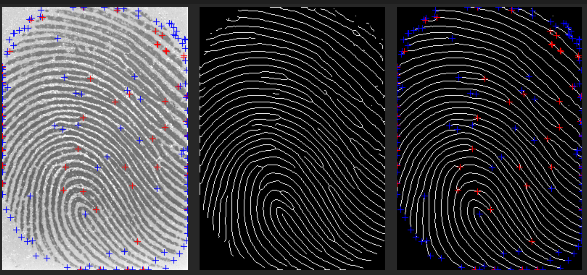
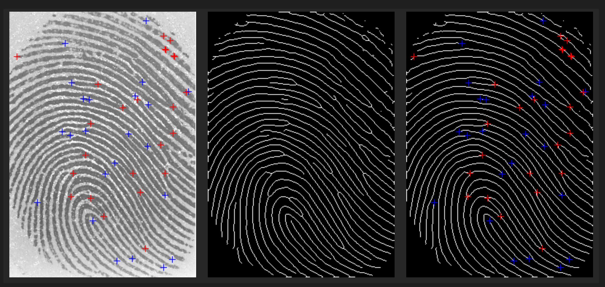

While working on question 1 of the second assignment for ELEC4630 i got to learn about many of the steps taken in the Jupyter notebook to provide a similarity
percentage for fingerprints of randomly selected images. Sobel filters which were used in the first assignment for edge detection were used to calculate the local
gradient of a finger print image for x and y.

Working on this part of the assignment provided me with insight about the techniques and concepts regarding fingerprint detection. Several  steps were taken in 
the provided algorithm to be able to calculate the necessary data for fingerprint comparison such as Minutiae and Local structures.

In a fingerprint image a detection of minutiae positions was carried out through a process of Binarization and thinning of ridge lines. 
I come to learn that when working with fingerprint images the algorithm could detect false minutiae positions and through computing the distance transform these
false positions would get removed and not included in the final data structure to be used for later processing and comparison, images here show the false positions 
before and after being removed.

Before removal of false positions.

After removal of false positions.

The distance transform seems to be a powerful tool in image processing that provides the ability to exclude minutiae that is too close to the border resulting in an
dataset more reliable for further processing or comparison.
